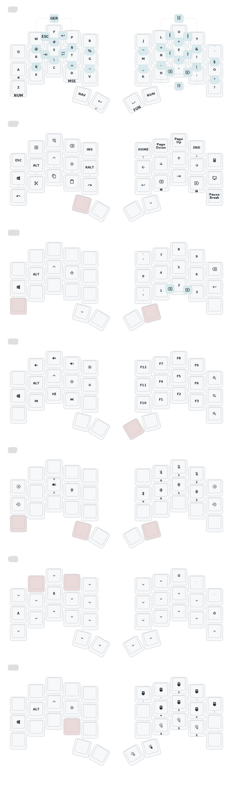

# zmk-config

  
<a href="https://github.com/davidphilipbarr/Sweep">Sweep</a> (34 keys), <i><b>click here to see the keymap!</i></b>

  

  _(keymap image generated by [caksoylar/keymap-drawer](https://github.com/caksoylar/keymap-drawer))_

  
<a href="https://github.com/AlaaSaadAbdo/Rommana">Rommana</a> (30 keys), <i><b>click here to see the keymap!</i></b>

  

  _(keymap image generated by [caksoylar/keymap-drawer](https://github.com/caksoylar/keymap-drawer))_

---

### Inspirations

- https://github.com/joelspadin/zmk-locale-generator
- https://github.com/caksoylar/zmk-config
- https://github.com/urob/zmk-config
- https://github.com/minusfive/zmk-config
- https://stevep99.github.io/seniply/
