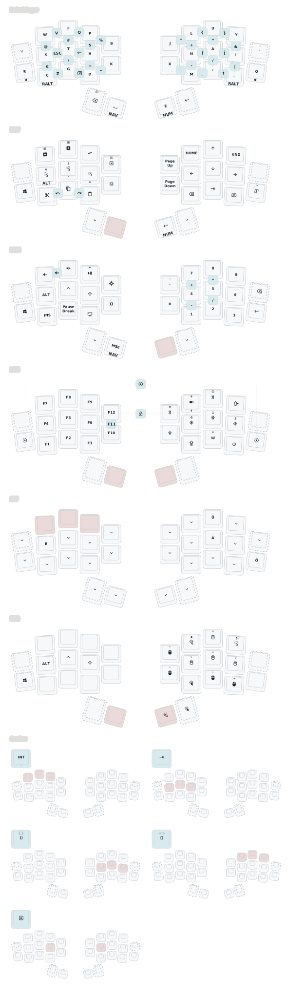
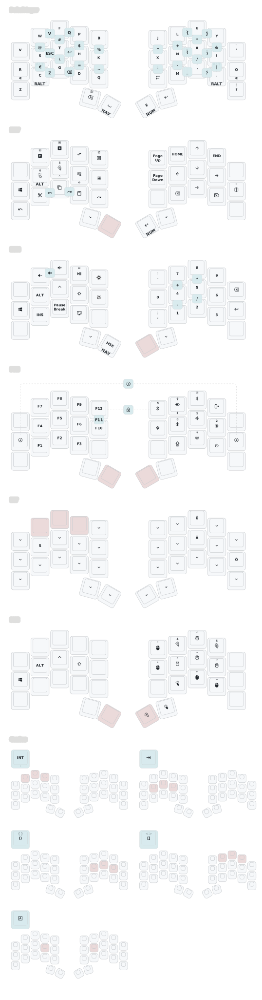
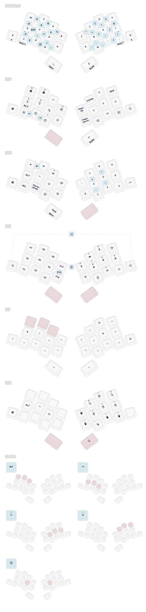

# zmk-config

This is my personal [zmk-config](https://zmk.dev/) for my ergo keyboards.
It consists of a common keymap with [Aptmak](https://github.com/Apsu/aptmak) as alpha layer and is optimized for 26 keys by heavily relying on combos for the missing alpha and symbol keys.

The configuration of the split boards includes the definition of a dongle that can optionally be used to extend the battery life of the left half (both sides will be peripherals). As a nice side effect, the keyboard can also be used wirelessly in the BIOS or if no Bluetooth adapter is available.

## Modules

Additional features are provided by the following [modules](https://zmk.dev/docs/features/modules):

- [**zmk-antecedent-morph**](https://github.com/ssbb/zmk-antecedent-morph) to change the behavior of a key based on the previously pressed key. This is used to type `<=`, `>=`, `!=`, `=>`, `->`, `|>`, `./` and `#include ` more comfortably.  
- [**zmk-dongle-display**](https://github.com/englmaxi/zmk-dongle-display) to show the peripheral battery percentage (and more!) on the display of my dongle.
- [**zmk-locales**](https://github.com/joelspadin/zmk-locales) to provide key codes for non-US keyboard locales.
- [**zmk-rgbled-widgets**](https://github.com/caksoylar/zmk-rgbled-widget) to show the connection and battery status with the built-in LEDs of the Xiao BLE controller. Based on this, the module was adapted in [led_indicator](boards/shields/led_indicator) to be used with the single LED of the nice!nano.
- [**zmk-tri-state**](https://github.com/urob/zmk-tri-state) to define a custom <kbd>swapper</kbd> and a <kbd>select-word</kbd> behavior.

## Boards and Keymaps

  
<a href="https://github.com/AlaaSaadAbdo/Rommana">Rommana</a> (26-30 keys)

  

  _(keymap image created with [caksoylar/keymap-drawer](https://github.com/caksoylar/keymap-drawer))_

  
<a href="https://github.com/davidphilipbarr/Sweep">Sweep</a> (34 keys)

  

  _(keymap image created with [caksoylar/keymap-drawer](https://github.com/caksoylar/keymap-drawer))_

  
<a href="https://github.com/grassfedreeve/akohekohe">ʻākohekohe</a> (26 keys)

  

  _(keymap image created with [caksoylar/keymap-drawer](https://github.com/caksoylar/keymap-drawer))_

 

## Inspirations

- [caksoylar/zmk-config](https://github.com/caksoylar/zmk-config)
- [minusfive/zmk-config](https://github.com/minusfive/zmk-config)
- [stevep99/seniply](https://stevep99.github.io/seniply/)
- [urob/zmk-config](https://github.com/urob/zmk-config)
